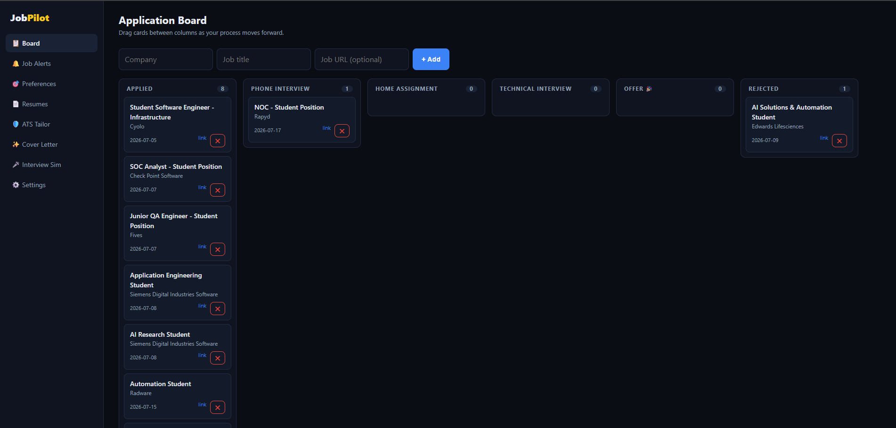
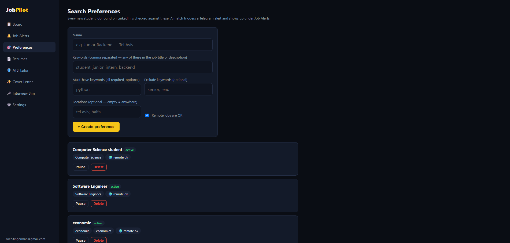
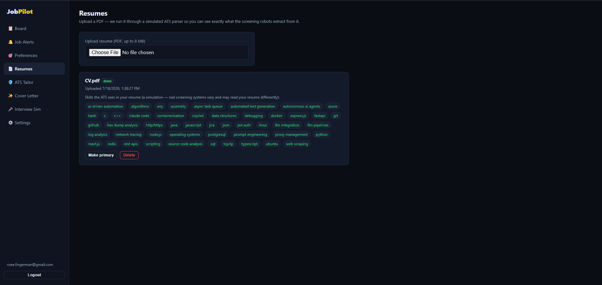
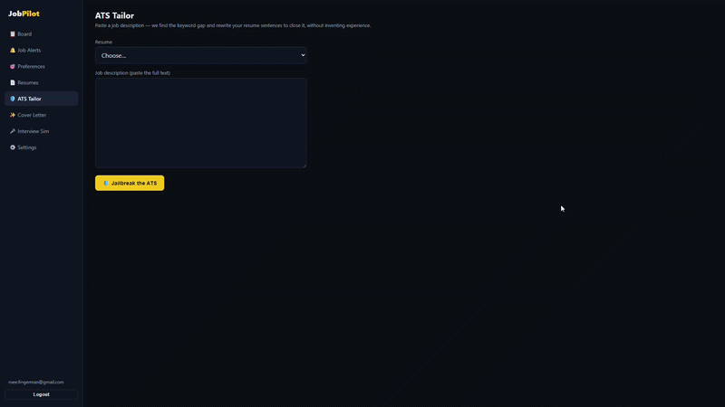

[](https://job-search-platform-chi.vercel.app)


# 🚀 Job Search Platform

A web platform for students and junior engineers that solves two pains:
managing many job applications, and getting past automated resume screeners (ATS).

**🔗 Live:** [job-search-platform-chi.vercel.app](https://job-search-platform-chi.vercel.app)

## ✨ Features

1. 🔔 **Real-Time Job Alerts** — users define search preferences; a background
   worker polls external job APIs. Every new student job is broadcast to a
   community **Discord channel**, and jobs matching a user's saved criteria
   are pushed personally via a **Telegram bot**.
2. 🛡️ **ATS Jailbreaker & Resume Tailoring** — upload a PDF resume, paste a job
   description; the system simulates an ATS parser, then uses an LLM to find
   the semantic gap and rewrite sentences to organically inject keywords.
3. 🗂️ **Kanban Application Tracker** — drag-and-drop CRM board
   (Applied → Phone Interview → Home Assignment → Technical Interview → Rejected / Offer).
4. ✍️ **Magic Cover Letter** — LLM-generated targeted cover letters and LinkedIn messages.
5. 🎤 **Interview Simulator** — a two-stage mock interview built from a resume and
   a real job description: behavioral warm-up questions, then timed technical
   questions (15 min each, real-interview weight) with an AI-graded report
   (score /100, per-question review, strengths/improvements) at the end.

## 📸 App Walkthrough

### 📋 Application Board
An interactive Kanban board to seamlessly track your job application process from screening to offer.
<br/>


### 🎯 Search Preferences & Job Alerts
Define specific keywords and locations. Background workers scrape and check for matches hourly, delivering targeted roles directly to your dashboard and Telegram.
<br/>

<br/><br/>


### 📄 Resume ATS Parsing
Upload your PDF resume to simulate exactly how real-world ATS screening robots extract and map your technical skills.
<br/>


### 🦹 ATS Tailor
Analyze the keyword gap between your resume and a specific job description, seamlessly adjusting your resume to bypass ATS filters.
<br/>


### ✨ Magic Cover Letter
Generate highly targeted cover letters and recruiter messages grounded strictly in your actual resume and the job requirements.
<br/>


### 🎙️ AI Interview Simulator
A comprehensive, multi-stage interactive interview environment powered by the Gemini API.

#### Stage 1: Behavioral & Background
Practice common HR and behavioral questions with dynamic, context-aware AI follow-ups.
<br/>


#### Stage 2: Technical Round (Interactive IDE)
Solve algorithmic challenges and system design questions in a built-in code editor while managing time constraints.
<br/>


#### 📊 Final Grade & Performance Report
Upon completion, receive a detailed evaluation including communication skills, architectural approach, and specific code complexity feedback.
<br/>


## 🛠️ Stack

| Layer      | Technology                                          |
|------------|-----------------------------------------------------|
| Frontend   | React (Vite + TS) + dnd-kit, deployed on Vercel     |
| Backend    | Python / FastAPI (async), served by Uvicorn         |
| Worker     | ARQ (async task queue + cron) over Redis            |
| Database   | PostgreSQL 16                                       |
| Queue      | Redis (local, on the same VM)                       |
| Job source | Bright Data LinkedIn jobs API (Remotive dev fallback) |
| AI         | Gemini (`gemini-3.1-flash-lite`) via REST           |
| Hosting    | Azure Standard_B1s Ubuntu VM (systemd + nginx)      |

## 📁 Repository layout

```
backend/    FastAPI app, services, ARQ worker (see backend/app/)
frontend/   React SPA (bootstrap instructions in frontend/README.md)
db/         schema.sql — canonical PostgreSQL DDL
deploy/     systemd units, nginx config, VM setup script
docs/       ARCHITECTURE.md, DEPLOYMENT.md
```

## ⚡ Quick start (local dev)

```bash
# 1. Database
createdb jobsearch && psql -d jobsearch -f db/schema.sql

# 2. Backend
cd backend
python -m venv .venv && source .venv/bin/activate   # Windows: .venv\Scripts\activate
pip install -r requirements.txt
cp .env.example .env                                 # fill in secrets
uvicorn app.main:app --reload                        # API on :8000

# 3. Worker (separate terminal, same venv)
arq app.workers.settings.WorkerSettings

# 4. Frontend (separate terminal)
cd frontend
npm install && npm run dev                           # web app on :5173
```

Read [docs/ARCHITECTURE.md](docs/ARCHITECTURE.md) first, then
[docs/DEPLOYMENT.md](docs/DEPLOYMENT.md) for the Azure VM rollout.
